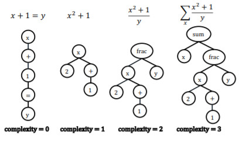
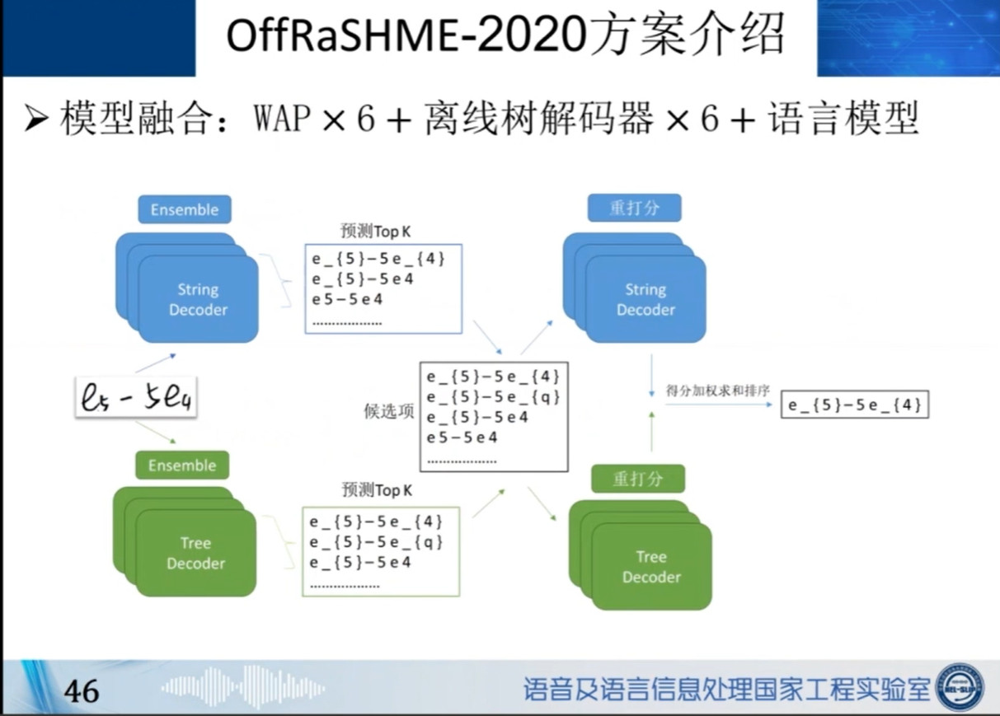
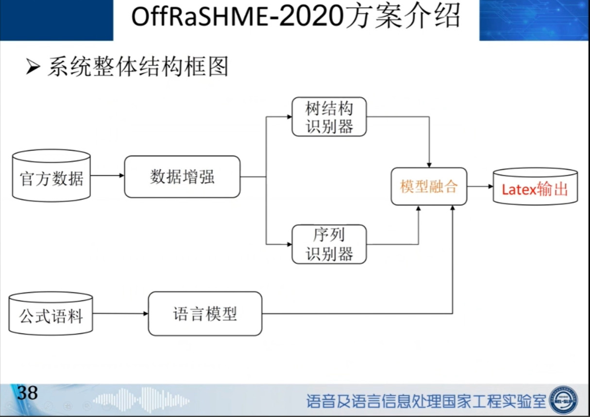
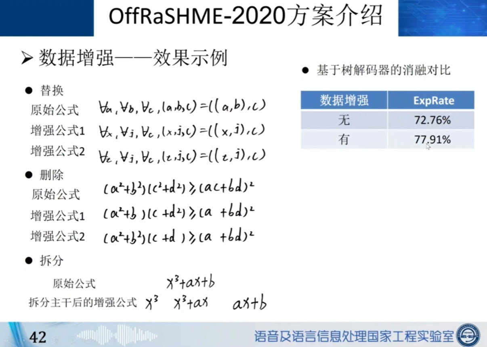
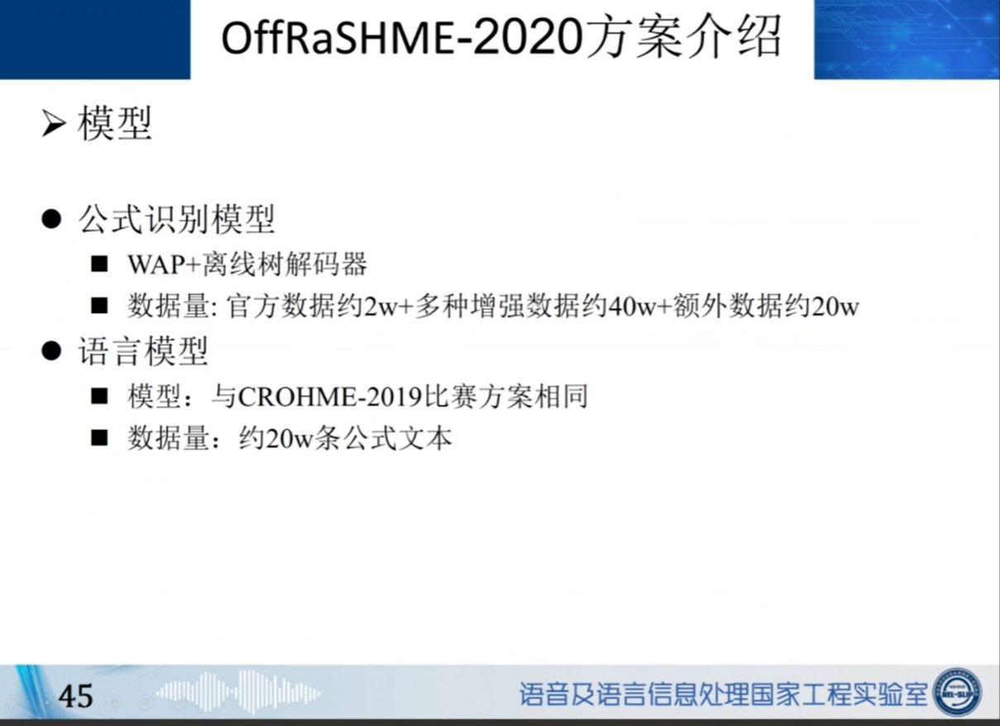
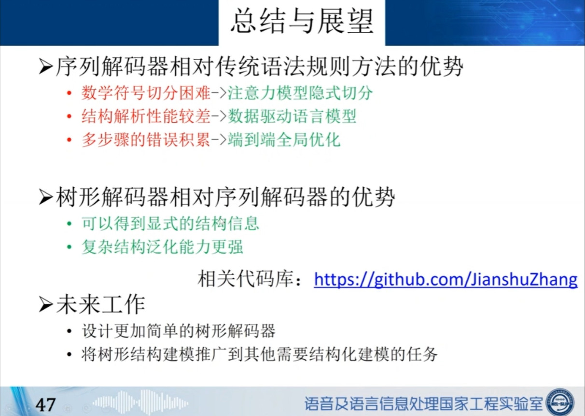

## 前言

这是我的第一篇技术博客，在2021年冬至这天诞生，还是有点意义。

## 正式内容

其实两周前就该写了，一直有事拖拖拖😓，好吧，说回主题，初高中数学公式识别，在国内做的比较好的应该算是中科大杜俊教师实验室（据我所知），恰好在2020年的CSIG2020会议上，杜俊老师做了一个关于手写公式相关研究的汇报，这次就首先将这次汇报比较重要的信息整理一下吧。	

​	TAP是一种基于基于enconder-decoder的端到端的online数学公式识别算法。链接https://ieeexplore.ieee.org/abstract/document/8373726

​	为解决offline数学公式识别，同时引入attention机制，后面又提出了WAP这种网络结构，链接http://home.ustc.edu.cn/~xysszjs/paper/PR2017.pdf

​	在WAP网络结构基础上，为了识别更复杂的公式，一种树解码器被提出，就是将公式用树形结构来做表示，尤其是对于结构更加复杂的数学公式，这种树形解码器，能够更好的表示公式，从而提高模型识别的精度。下面就是公式树形表示示意图

​	最后杜俊老师主要讲解了他们团队在参加offRaSHME-2022的技术方案，以及数据增强方法

​	

最后做了一个总结与展望

总体而言，一般的简单的数学公式使用带attention结构的编解码模型应该都可以识别，只要数据量够大，模型效果就越好，而对于复杂的数学公式，就需要用到较为复杂一点的数据表示格式来辅助提升算法。

## 最后

​	花了点时间在github上搜了一下，目前有一些高赞的数学公式识别开源算法大概有以下几个：

​	https://github.com/LinXueyuanStdio/LaTeX_OCR_PRO

​	https://github.com/kingyiusuen/image-to-latex
